# Mwalimu-LangLearn: Comprehensive Codebase Analysis

> A multi-perspective deep-dive covering product strategy, system architecture, and implementation details.

---

## Table of Contents

1. [Project Identity & Purpose](#1-project-identity--purpose)
2. [Product Manager Perspective](#2-product-manager-perspective)
3. [Software Architect Perspective](#3-software-architect-perspective)
4. [Software Developer Perspective](#4-software-developer-perspective)
5. [AI/ML Engineering Deep-Dive](#5-aiml-engineering-deep-dive)
6. [Data Flows & State Management](#6-data-flows--state-management)
7. [User Experience & Interface Design](#7-user-experience--interface-design)
8. [Gaps, Risks & Recommendations](#8-gaps-risks--recommendations)

---

## 1. Project Identity & Purpose

**Mwalimu-LangLearn** is an AI-powered, multimodal language learning platform developed as part of a Master's thesis at the **Kobe Institute of Computing, Japan**. "Mwalimu" means *Teacher* in Swahili — a name that anchors the project to its core mission: delivering high-quality, personalized language education in resource-constrained environments.

| Attribute | Detail |
|---|---|
| Author | Pascal Burume Buhendwa |
| Institution | Kobe Institute of Computing (ABE Initiative / JICA) |
| Thesis | *"AI in Education for Sustainable Development in the Democratic Republic of Congo"* |
| License | MIT |
| Primary Target | Learners in Sub-Saharan Africa (DRC) |
| Core Model | Google Gemma 3n E2B-IT |
| Interface | Gradio 4.x Web Application |
| Repository Type | Jupyter Notebook (research prototype) |

### Research Questions

1. Can small, locally-running AI models deliver educationally meaningful feedback comparable to expert human tutors?
2. How can such systems serve learners in low-resource, low-connectivity environments?

---

## 2. Product Manager Perspective

### 2.1 Problem Space

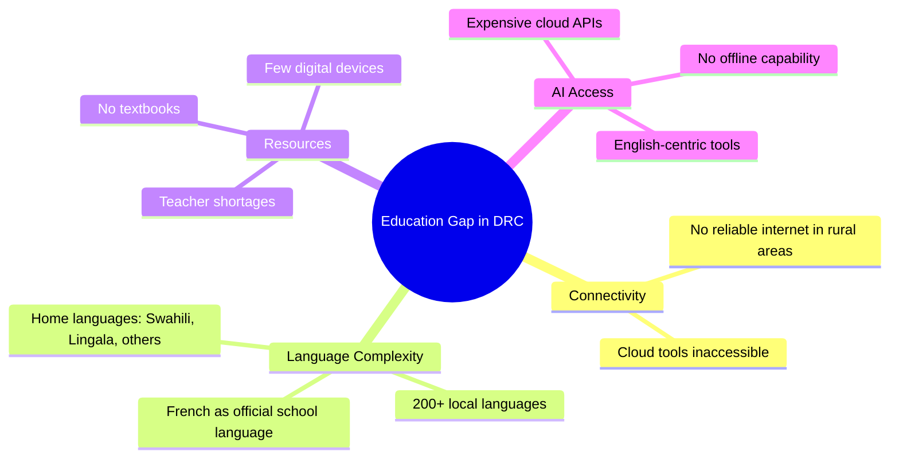

The Democratic Republic of Congo faces compounding educational barriers. Students switch between home languages (Swahili, Lingala) and the official school language (French), while schools lack qualified language teachers, textbooks, and digital infrastructure. Cloud-based AI tools cannot reach these learners due to connectivity gaps.

### 2.2 Value Proposition

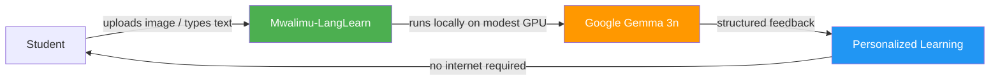

**Core Value**: Immediate, personalized, multilingual language feedback — without cloud dependency, without subscription costs, without qualified teacher availability.

### 2.3 Feature Map

```mermaid
graph TD
    Platform[Mwalimu-LangLearn Platform]

    Platform --> F1[📝 Writing Feedback]
    Platform --> F2[🖼️ Visual Learning]
    Platform --> F3[🔄 Translation Practice]
    Platform --> F4[📚 Vocabulary Builder]
    Platform --> F5[💬 Conversation Practice]

    F1 --> F1a[Grammar correction]
    F1 --> F1b[Vocabulary alternatives]
    F1 --> F1c[Style tips]
    F1 --> F1d[Score A1-C2]

    F2 --> F2a[Object identification from photo]
    F2 --> F2b[Translations + pronunciation]
    F2 --> F2c[Example sentences]
    F2 --> F2d[Cultural notes]

    F3 --> F3a[Student translation evaluation]
    F3 --> F3b[Accuracy score 1-10]
    F3 --> F3c[Error analysis]
    F3 --> F3d[Alternative translations]

    F4 --> F4a[Themed vocabulary lesson]
    F4 --> F4b[Fill-in-blank quiz]
    F4 --> F4c[Memory mnemonics]
    F4 --> F4d[5 to 20 words]

    F5 --> F5a[8 real-world scenarios]
    F5 --> F5b[Inline correction notes]
    F5 --> F5c[Stateful session history]
    F5 --> F5d[Natural dialogue]
```

### 2.4 Supported Languages

The platform deliberately includes African languages under-represented in commercial tools:

| Region | Languages |
|---|---|
| African / DRC-Relevant | Swahili, Lingala, French, Arabic |
| European | English, Spanish, Portuguese, German, Italian, Russian |
| Asian | Japanese, Chinese (Mandarin), Korean, Hindi |

**Total: 14 languages** — backed by Gemma 3n's 140+ language training corpus.

### 2.5 User Journeys

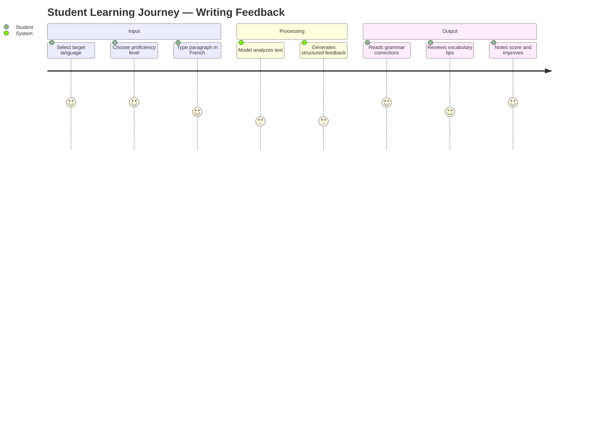

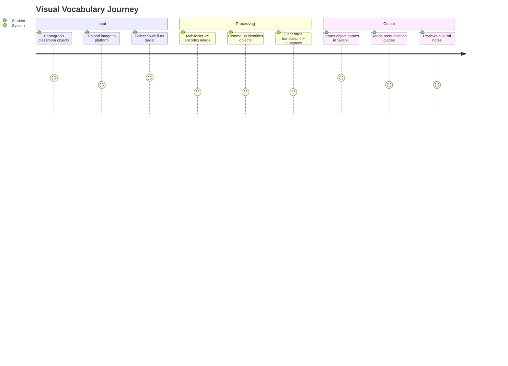

### 2.6 Roadmap & Future Work

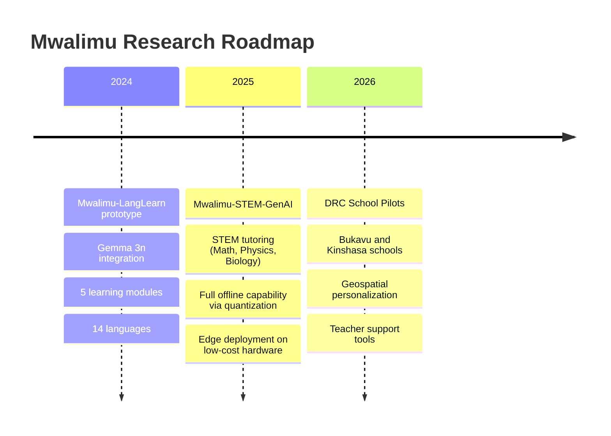

---

## 3. Software Architect Perspective

### 3.1 System Architecture Overview

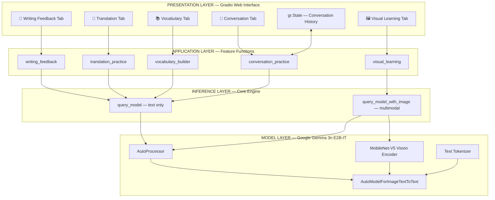

**Key architectural principle**: The inference layer (`query_model`, `query_model_with_image`) is deliberately decoupled from feature logic. This allows swapping the underlying model (e.g., a quantized GGUF model for Android) without touching any feature or UI code.

### 3.2 Deployment Architecture

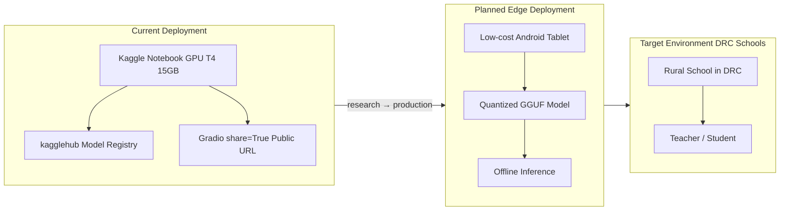

### 3.3 Model Loading Strategy

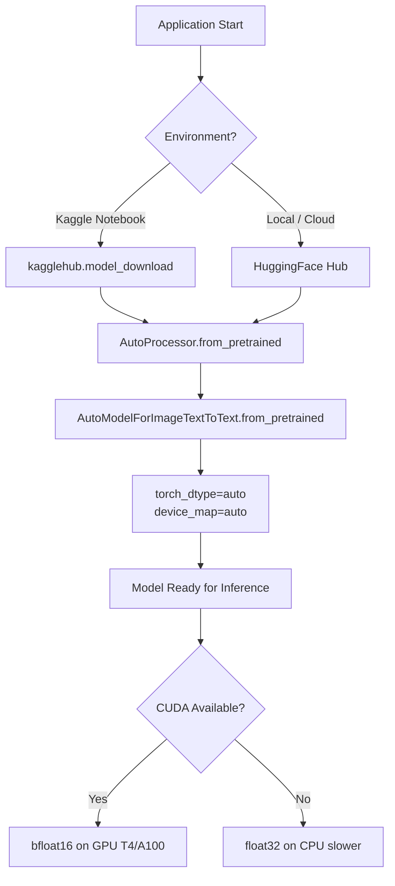

### 3.4 Component Dependencies

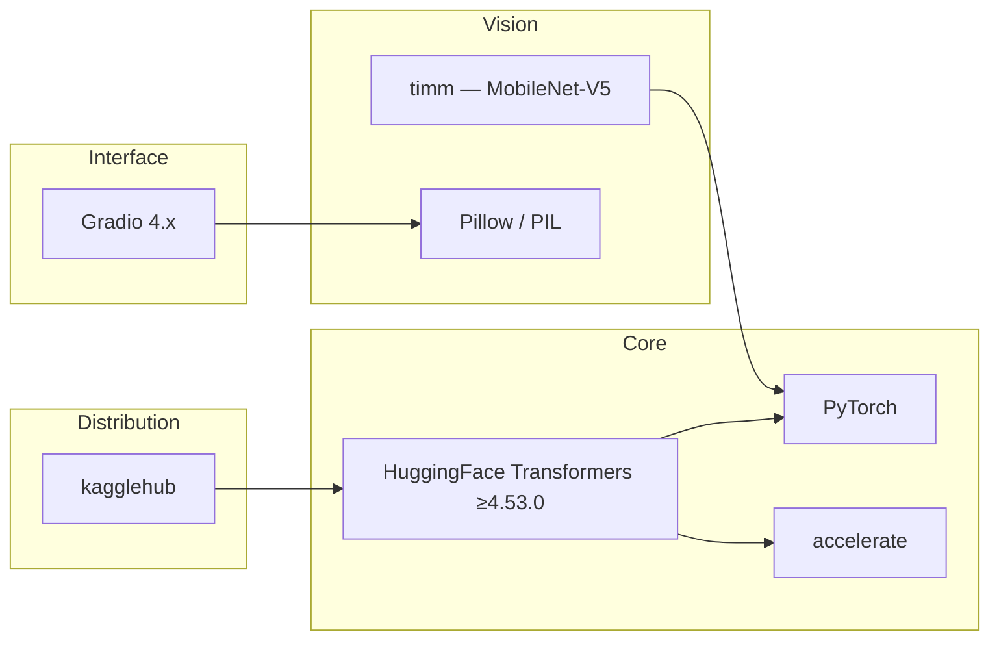

### 3.5 Stateful vs. Stateless Features

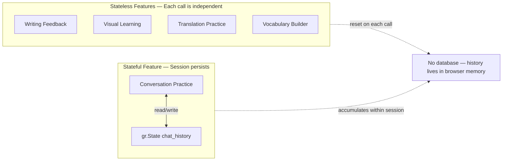

---

## 4. Software Developer Perspective

### 4.1 Repository Structure

```
/Mwalimu-LangLearn/
├── README.md                              # Project documentation (183 lines)
├── Gemma3n_language_learning_Tool.ipynb   # Complete implementation (21 cells, ~2000 lines)
└── .git/                                  # Version control
```

This is a **notebook-first research project**. The entire application — model loading, inference engine, feature functions, and Gradio UI — lives in a single Jupyter notebook organized into 8 sequential steps.

### 4.2 Notebook Cell Organization

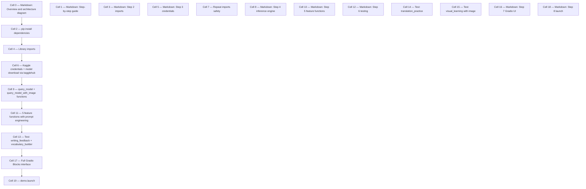

### 4.3 Core Inference Functions

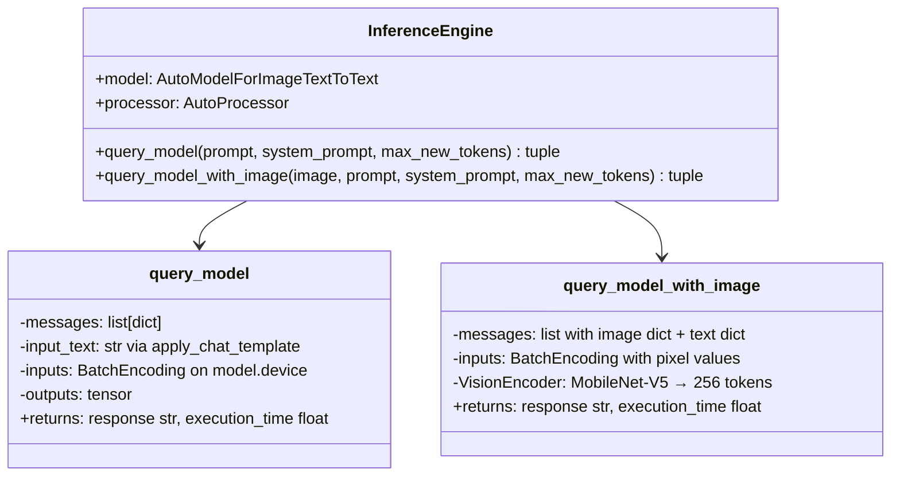

**Text-Only Inference — `query_model()`**

```python
def query_model(prompt, system_prompt=None, max_new_tokens=512):
    messages = []
    if system_prompt:
        messages.append({"role": "system", "content": system_prompt})
    messages.append({"role": "user", "content": prompt})

    input_text = processor.apply_chat_template(
        messages, tokenize=False, add_generation_prompt=True
    )
    inputs = processor(text=input_text, return_tensors="pt").to(model.device)

    with torch.no_grad():
        outputs = model.generate(
            **inputs,
            max_new_tokens=max_new_tokens,
            temperature=0.7,
            top_p=0.9,
            do_sample=True
        )

    response = processor.batch_decode(outputs, skip_special_tokens=True)[0]
    # Extracts only the model's response portion
    return response, execution_time
```

**Multimodal Inference — `query_model_with_image()`**

```python
def query_model_with_image(image, prompt, system_prompt=None, max_new_tokens=512):
    messages = [
        {"role": "user", "content": [
            {"type": "image", "image": pil_image},   # → MobileNet-V5 → 256 tokens
            {"type": "text",  "text": full_prompt}
        ]}
    ]
    inputs = processor(
        text=input_text,
        images=pil_image,
        return_tensors="pt"
    ).to(model.device)
    # Generation identical to text-only path
```

### 4.4 Feature Functions — Prompt Engineering Pattern

Each of the 5 feature functions follows the same structure:

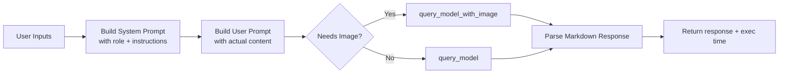

**System Prompt Pattern — Writing Feedback**

```python
system_prompt = f"""You are an expert {target_language} language tutor working with a {proficiency_level} student.
Provide detailed, encouraging, and educational feedback on their writing.

Format your response as:
1. **Overall Assessment**
2. **Grammar Corrections** (with explanations)
3. **Vocabulary Suggestions**
4. **Style & Flow Tips**
5. **Encouragement & Score** (out of 10)"""
```

All 5 features use this "role + numbered output format" pattern in their system prompts, enabling consistent structured output without post-processing or parsing code.

### 4.5 Generation Parameters

| Parameter | Value | Rationale |
|---|---|---|
| `temperature` | `0.7` | Balance creativity and coherence — avoids both repetition and hallucination |
| `top_p` | `0.9` | Nucleus sampling — maintains diversity while filtering low-probability tokens |
| `do_sample` | `True` | Sampling mode (vs. greedy decoding) for more natural language |
| `max_new_tokens` | `512–1500` | Varies per feature: vocabulary builder uses 1500, writing feedback 1024 |

### 4.6 Conversation State Management

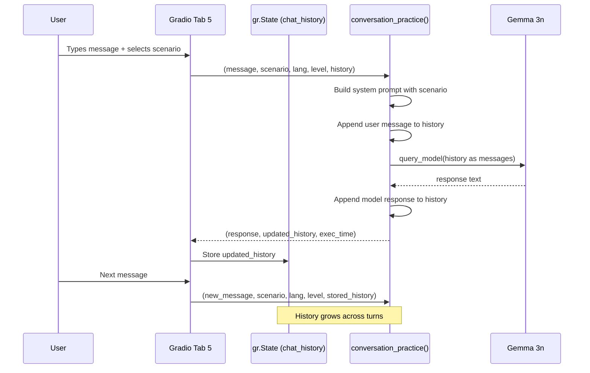

History is stored as a Python list of `{"role": ..., "content": ...}` dicts in `gr.State()` — a Gradio hidden component that persists within a browser session. It is not persisted to disk or database.

### 4.7 Gradio UI Component Hierarchy

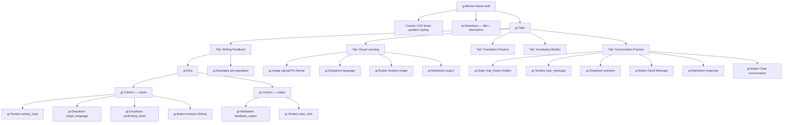

### 4.8 Dependency Installation (Cell 2)

```bash
pip install transformers>=4.53.0 \
            torch \
            gradio \
            Pillow \
            kagglehub \
            accelerate \
            timm
```

No `requirements.txt`, `pyproject.toml`, or `setup.py` exists. Dependencies are installed via the first notebook cell — standard practice for Kaggle notebooks.

### 4.9 Environment & Credentials

```python
# Kaggle API credentials (set as environment variables — never hardcoded)
os.environ['KAGGLE_USERNAME'] = 'your_kaggle_username'
os.environ['KAGGLE_KEY']      = 'your_kaggle_api_key'

# Model download
model_path = kagglehub.model_download("google/gemma-3n/transformers/gemma-3n-e2b-it")
```

On local/non-Kaggle environments, the model is loaded directly from HuggingFace Hub using the same `from_pretrained()` API.

---

## 5. AI/ML Engineering Deep-Dive

### 5.1 Gemma 3n Architecture

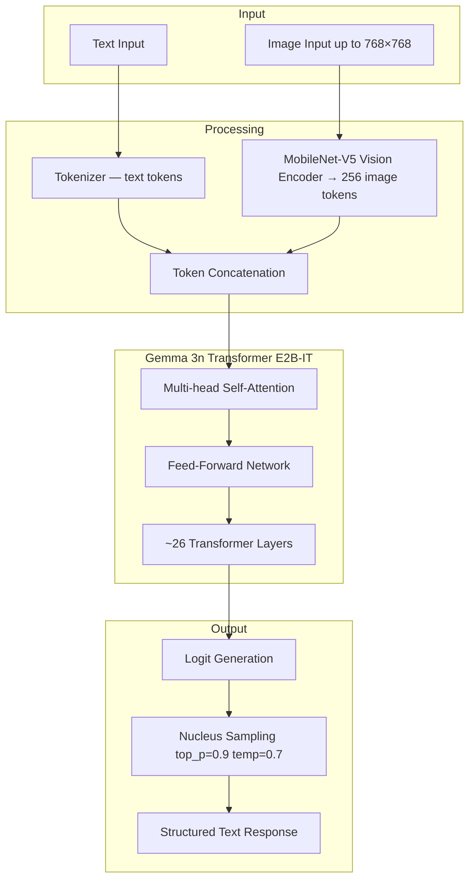

### 5.2 Chat Template Structure

Gemma 3n uses HuggingFace's standard chat template with model-specific special tokens:

```
<start_of_turn>system
You are an expert French language tutor...
<end_of_turn>
<start_of_turn>user
Je suis allé au magazin...
<end_of_turn>
<start_of_turn>model
[GENERATED RESPONSE]
```

The `apply_chat_template()` call handles this formatting automatically from the structured `messages` list.

### 5.3 Inference Pipeline

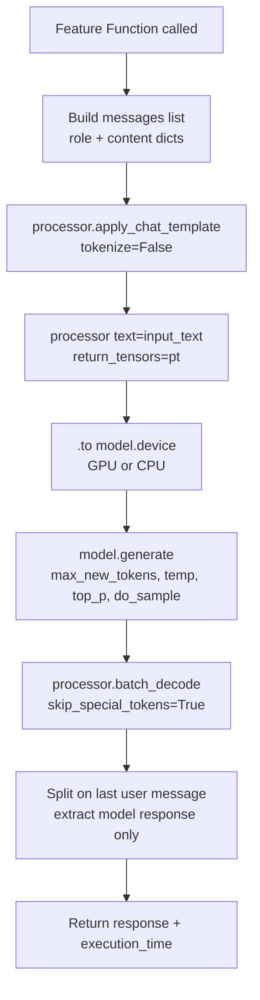

### 5.4 Model Variants

| Variant | Effective Params | Total Params | VRAM Req. | Use Case |
|---|---|---|---|---|
| Gemma 3n E2B-IT | ~2B effective | ~6B total | ~8GB | Used in this project — Kaggle T4 GPU |
| Gemma 3n E4B-IT | ~4B effective | ~12B total | ~15GB | Higher quality, still fits T4 |
| Quantized GGUF | ~1-2B effective | varies | ~4GB | Planned for Android edge deployment |

The E2B variant uses **parameter sharing** across transformer layers, achieving effective 2B parameter inference with a full 6B parameter model — the key to its efficient memory footprint.

### 5.5 Prompt Engineering Strategy

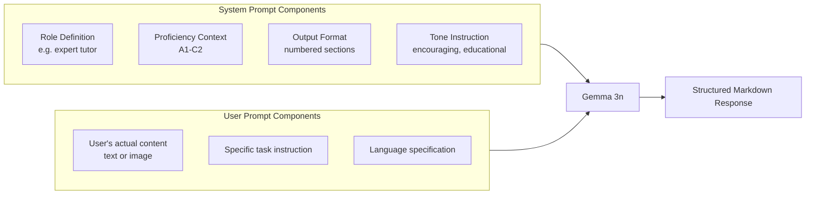

No output parsers, JSON schemas, or regex post-processing are used. All structure is achieved through prompt engineering alone — the model reliably produces numbered sections with bold headers due to the instruction-tuned training.

---

## 6. Data Flows & State Management

### 6.1 Writing Feedback Data Flow

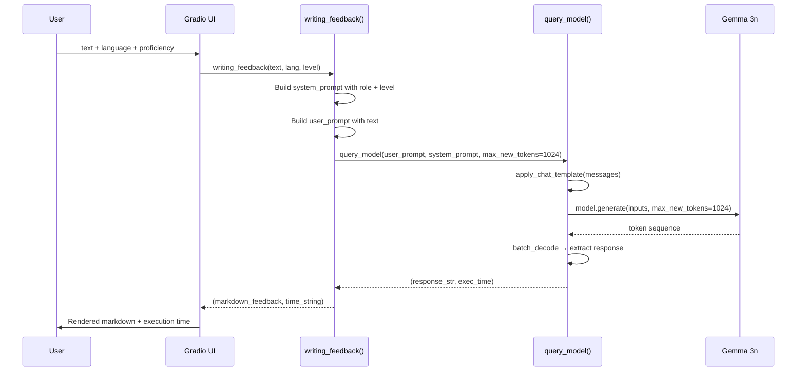

### 6.2 Visual Learning Data Flow

```mermaid
sequenceDiagram
    participant U as User
    participant UI as Gradio UI
    participant VL as visual_learning()
    participant QMI as query_model_with_image()
    participant VE as MobileNet-V5
    participant G as Gemma 3n

    U->>UI: image file + target language + source language
    UI->>VL: visual_learning(image, target_lang, source_lang)
    VL->>VL: Build system_prompt for visual vocabulary
    VL->>VL: Build user_prompt requesting object list + translations
    VL->>QMI: query_model_with_image(image, prompt, system_prompt)
    QMI->>QMI: Construct multimodal messages dict
    QMI->>VE: Encode image → 256 tokens
    VE-->>QMI: pixel_values tensor
    QMI->>G: model.generate(text_tokens + image_tokens)
    G-->>QMI: token sequence
    QMI->>QMI: decode → extract response
    QMI-->>VL: (response_str, exec_time)
    VL-->>UI: (vocabulary_markdown, time_string)
    UI->>U: Objects + translations + cultural notes
```

### 6.3 Conversation Practice State Machine

```mermaid
stateDiagram-v2
    [*] --> Empty: Session Start
    Empty --> FirstTurn: User sends first message
    FirstTurn --> OngoingConversation: Model responds
    OngoingConversation --> OngoingConversation: User sends follow-up
    OngoingConversation --> Empty: User clicks Clear
    Empty --> [*]: Tab closed / session ends

    note right of OngoingConversation
        chat_history: [
          {role: system, content: scenario_prompt},
          {role: user, content: msg1},
          {role: assistant, content: resp1},
          {role: user, content: msg2},
          ...
        ]
    end note
```

### 6.4 Session Data Model

```mermaid
erDiagram
    SESSION {
        list chat_history
    }

    CHAT_MESSAGE {
        string role
        string content
    }

    INFERENCE_CALL {
        string prompt
        string system_prompt
        int max_new_tokens
        float temperature
        float top_p
        bool do_sample
    }

    INFERENCE_RESULT {
        string response
        float execution_time_seconds
    }

    SESSION ||--o{ CHAT_MESSAGE : contains
    INFERENCE_CALL ||--|| INFERENCE_RESULT : produces
```

No persistent storage. All data lives in memory for the duration of the Gradio session. Image data is processed as `PIL.Image` objects — never saved to disk.

---

## 7. User Experience & Interface Design

### 7.1 UI Layout

```mermaid
graph TD
    App[Gradio App max-width: 1200px]
    App --> Header[Header with gradient background]
    Header --> Title[🌍 Mwalimu-LangLearn title]
    Header --> Desc[Feature summary list]
    App --> Tabs[Tabbed Navigation]

    Tabs --> T1[Tab 1: 📝 Writing]
    Tabs --> T2[Tab 2: 🖼️ Visual]
    Tabs --> T3[Tab 3: 🔄 Translation]
    Tabs --> T4[Tab 4: 📚 Vocabulary]
    Tabs --> T5[Tab 5: 💬 Conversation]

    T1 --> T1Layout[Two-column layout]
    T1Layout --> T1Left[Left: inputs textarea + dropdowns + button]
    T1Layout --> T1Right[Right: markdown output + time display]
    T1 --> T1Examples[Examples: French paragraph with errors]

    T2 --> T2Layout[Two-column layout]
    T2Layout --> T2Left[Left: image upload + language dropdowns + button]
    T2Layout --> T2Right[Right: vocabulary markdown output]
    T2 --> T2Examples[Examples: classroom photo scenarios]

    T4 --> T4Special[Slider for word count 5-20]
    T5 --> T5Special[Scenario dropdown 8 options + Clear button]
```

### 7.2 Conversation Scenarios

The 8 built-in scenarios for Tab 5:

```
1. General Conversation
2. At a Restaurant
3. Asking for Directions
4. Shopping
5. Job Interview
6. Meeting New People
7. Travel & Tourism
8. Healthcare & Medical
```

### 7.3 Proficiency Levels (CEFR)

| Level Code | Label Used in UI |
|---|---|
| A1-A2 | Beginner (A1-A2) |
| B1-B2 | Intermediate (B1-B2) |
| C1-C2 | Advanced (C1-C2) |

The proficiency level is injected into the system prompt, causing the model to calibrate feedback depth, vocabulary complexity, and explanation detail accordingly.

### 7.4 Application Launch Configuration

```python
demo.launch(
    share=True,            # Generates public tunneled URL via Gradio servers
    server_name="0.0.0.0", # Listens on all network interfaces
    server_port=7860,       # Standard Gradio port
    show_error=True         # Surfaces Python exceptions in the UI for debugging
)
```

---

## 8. Gaps, Risks & Recommendations

### 8.1 Current Gaps

```mermaid
mindmap
  root((Current Gaps))
    Infrastructure
      No requirements.txt
      No Dockerfile
      No CI/CD pipeline
      No automated tests
    Security
      Credentials in notebook cells
      No authentication on Gradio interface
      No input validation
    Production Readiness
      No persistent storage
      No user accounts
      No usage logging
      No error monitoring
    Scalability
      Single-user inference model
      No request queuing
      GPU memory not managed between requests
```

### 8.2 Risk Matrix

| Risk | Likelihood | Impact | Mitigation |
|---|---|---|---|
| Kaggle API key exposed in notebook | High | High | Move to environment variables / secrets manager |
| Model hallucination in educational feedback | Medium | High | Add confidence scoring; human review layer |
| GPU memory exhaustion under concurrent load | Medium | High | Request queuing; `torch.cuda.empty_cache()` |
| Conversation history lost on page refresh | High | Medium | Acceptable for prototype; add persistence for production |
| No offline mode currently working | High | High | Model quantization (GGUF/ONNX) required for DRC deployment |
| Single point of failure (no fallback model) | Low | High | Add lighter fallback model for CPU-only environments |

### 8.3 Recommended Next Steps for Production

```mermaid
graph LR
    A[Current Prototype] --> B[Phase 1: Hardening]
    B --> B1[Add requirements.txt]
    B --> B2[Externalize credentials]
    B --> B3[Add basic input validation]
    B --> B4[Structure as Python package]

    B --> C[Phase 2: Offline Capability]
    C --> C1[Quantize model to GGUF 4-bit]
    C --> C2[Test on CPU-only hardware]
    C --> C3[Package as standalone app]
    C --> C4[Android / Raspberry Pi deployment]

    C --> D[Phase 3: Production]
    D --> D1[Add user authentication]
    D --> D2[Persist conversation history]
    D --> D3[Usage analytics for research]
    D --> D4[Teacher dashboard]
    D --> D5[DRC school pilot deployment]
```

### 8.4 Architecture for Edge Deployment (Planned)

```mermaid
graph TB
    subgraph EdgeDevice["Edge Device — Low-cost Android Tablet"]
        GGUF[Quantized Gemma 3n GGUF 4-bit ~3GB]
        LocalApp[Flutter / React Native App]
        SQLite[SQLite — Student Progress]
        LocalApp --> GGUF
        LocalApp --> SQLite
    end

    subgraph School["School Network optional"]
        Teacher[Teacher Dashboard]
        SyncServer[Sync Server]
        Teacher --> SyncServer
    end

    EdgeDevice -->|WiFi sync when available| School
    EdgeDevice -->|always works offline| EdgeDevice
```

---

## Summary

| Dimension | Current State | Maturity Level |
|---|---|---|
| AI/ML Core | Gemma 3n with 5 specialized features | Production-quality prompt engineering |
| Architecture | Clean 3-layer separation | Well-designed for future extension |
| Interface | Gradio 5-tab web app | Research prototype quality |
| Testing | Manual notebook tests only | Pre-alpha |
| Deployment | Kaggle notebook with share URL | Research demo |
| Security | Credentials in notebook | Needs hardening before any public deployment |
| Offline Capability | Not yet implemented | Planned for Mwalimu-STEM-GenAI phase |
| Language Coverage | 14 languages incl. Swahili, Lingala | Strong multilingual foundation |

**Mwalimu-LangLearn** is a technically sound research prototype that successfully demonstrates the feasibility of SLM-powered multilingual education. Its three-layer architecture is genuinely forward-looking — the clean inference abstraction will significantly reduce refactoring cost when transitioning to edge deployment. The primary work ahead is transforming the notebook into a deployable application with offline capability, persistence, and the security hardening needed for deployment in DRC schools.

---

*Analysis generated: 2026-03-12 | Repository: Mwalimu-LangLearn | Model: Google Gemma 3n E2B-IT*
